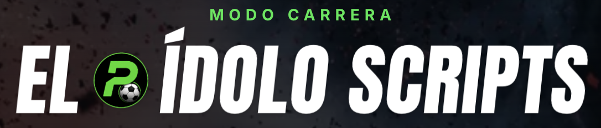
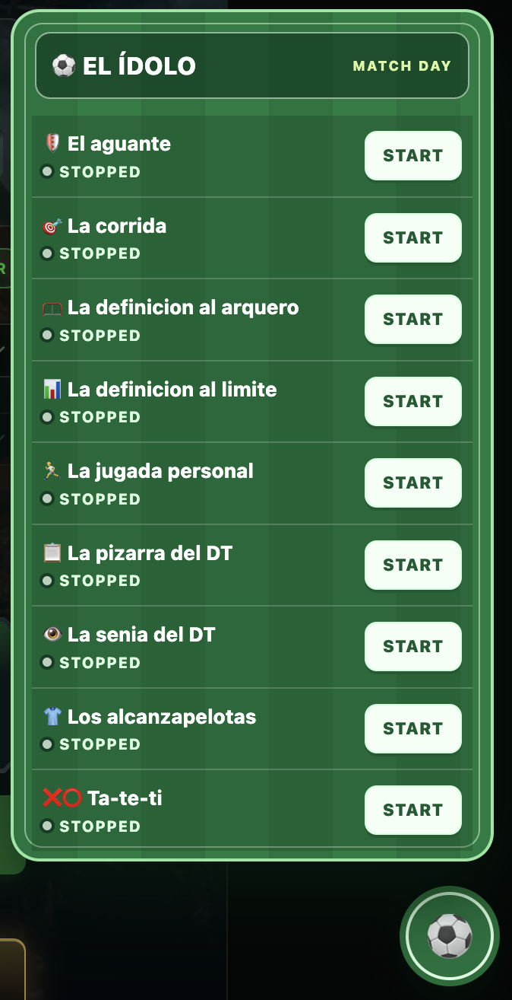

# El idolo scripts



Repo que tiene una colecion de scripts para jugar 🧠 habilidosos en el juego: [El Ídolo](https://www.potrerofutbol.ar/el-idolo/)

## Instalacion

1. Abrir la consola de [desarrolador](https://developer.chrome.com/docs/devtools/open)

    | OS | Console |
    | --- | --- |
    | Windows or Linux | Ctrl + Shift + J |
    | Mac | Cmd + Option + J |

2. Copiar el contenido del archivo `El Idolo menu.js` y pegarlo en la consola

## Fotos



> [!CAUTION]
> Siempre parar el script una vez se termino de usar, nnunca tener mas de un script activo al mismo tiempo

## Videos

### Instalación

https://github.com/user-attachments/assets/2c7e3225-41dc-4aa7-9571-c19bbd7be5a0

### Los alcanzapelotas

https://github.com/user-attachments/assets/deb84bfe-08f7-4249-a769-f3398b75444b

### Jugada personal

https://github.com/user-attachments/assets/3d392c01-4859-4f61-95b2-ddbc6505da1c

### La corrida

https://github.com/user-attachments/assets/bf728f3c-814b-4fd4-8007-163b2941a698

### La pizarra del DT

https://github.com/user-attachments/assets/01ee87bd-b408-4f28-bfee-ac66b27581d1

### La seña del DT

https://github.com/user-attachments/assets/ca4a5ebe-6090-41af-b34e-bc0bdce81213

## Para devs 🤓

Si por algun motivo queres cambiar algun script, cambiado y despues corres el siguiente comando

```bash
node build-menu.mjs
```
